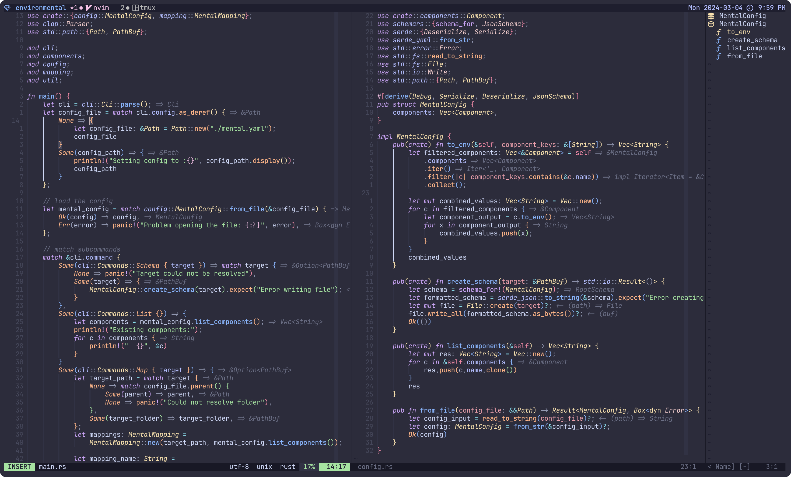

# Newmi1988 Neovim Config
My personal neovim config. Far from minimalistic. I experiment with all kinds of plugins.

## Screenshot

## dependencies
1. git
2. [fzf](https://github.com/junegunn/fzf) for fuzzy search
3. [ripgrep](https://github.com/BurntSushi/ripgrep) for blazingly fast grep like search
4. [Node.js](https://github.com/nodejs/node) for LSPs

## Packages
There are a ton of plugins in my config.
Some are rearly used but others all the time.
### Most productive use 🛠️
The most used are probably the following:
- [telescope](https://github.com/nvim-telescope/telescope.nvim)
- [fzf.vim](https://github.com/junegunn/fzf.vim)
- [fugitive](https://github.com/tpope/vim-fugitive)
- [diffview](https://github.com/sindrets/diffview.nvim)
- [undotree](https://github.com/mbbill/undotree)
- [gitsigns](https://github.com/lewis6991/gitsigns.nvim)
- [flash](https://github.com/folke/flash.nvim)
- [treesj](https://github.com/Wansmer/treesj)

### Theme + Styling 🎨
- Colortheme and Code Style: [catppuccin](https://github.com/catppuccin/nvim)
- Outlines: [aerial](https://github.com/stevearc/aerial.nvim)
- Indent Line: [indent-blankline](https://github.com/lukas-reineke/indent-blankline.nvim)
- Rainbow Stuff: [rainbow-delimiters](https://gitlab.com/HiPhish/rainbow-delimiters.nvim)
- Breadcrumps: [dropbar](https://github.com/Bekaboo/dropbar.nvim)

### Cool stuff 🎉🎊
- [todo-comments](https://github.com/folke/todo-comments.nvim) 
- [Trouble](https://github.com/folke/trouble.nvim)

## Install
Given you have the dependencies this setup should bootstrap itself.
It uses [lazy.nvim](https://github.com/folke/lazy.nvim) to install plugins.